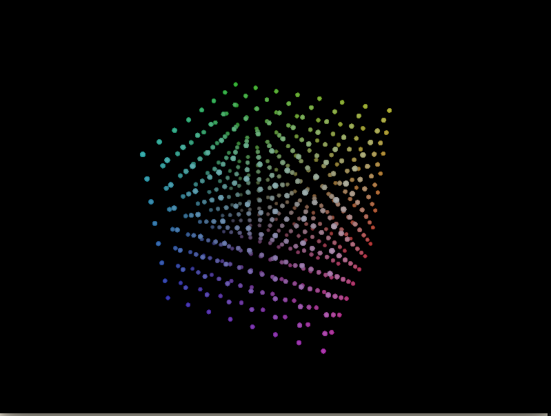

# voxel-preview
Faux 3D LED Cube in Rust

# About
This is a test client which renders an [8x8x8 LED cube display](https://www.aliexpress.com/item/DIY-3D8-multicolor-mini-LED-light-display-Excellent-animation-3D-8-8x8x8-Electronic-Kits-Junior/32700909987.html). The cube listens over UDP for OSC packets and updates voxels accordingly.

# Dependencies
  - [`kiss3d`](http://kiss3d.org/) for 3d rendering
  - [`rosc`](https://github.com/klingtnet/rosc) for osc protocol
  - `nalgebra`

# Example


# OSC Schema

This is the fully-defined schema for painting points, lines, planes, faces,
cuboids, and freely-defined 3D shapes in either solids or gradients. We use OSC's native Color type for the `rgb` variables and ints for the x y z coordinates.

```
  /pt    x y z rgb
  /line  x1 y1 z1 x2 y2 z2 rgb 
  /line  x1 y1 z1 x2 y2 z2 rgb1 rgb2 
  /plane ox oy oz v1x v1y v1z v2x v2y v2z rgb
  /plane ox oy oz v1x v1y v1z v2x v2y v2z rgb1 rbg2 cx cy cz
  /face  n x1 y1 z1 ... xn yn zn rgb
  /face  n x1 y1 z1 ... xn yn zn rgb1 rgb2 cx cy cz
  /cubo  ox oy oz v1x v1y v1z v2x v2y v2z v3x v3y v3z rgb
  /cubo  ox oy oz v1x v1y v1z v2x v2y v2z v3x v3y v3z rgb1 rgb2 cx cy cz
  /free  n x1 y1 z1 ... xn yn zn rgb
  /free  n x1 y1 z1 ... xn yn zn rgb1 rgb2 cx cy cz
  /all   rgb
  /all   rgb1 rgb2 cx cy cz
```

*NB*: 
 - `x`, `y`, and `z` must be in the range `[0..N)`, where `N` is the static `CUBE_WIDTH`. 
 - `r`, `g`, and `b` must be in the range `[0..1]`, to be valid RGB values.

